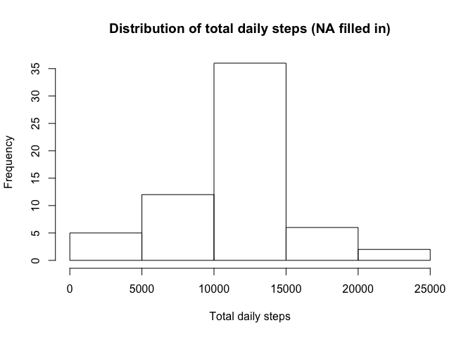

# Reproducible Research: Peer Assessment 1

## Loading and preprocessing the data

```r
unzip("activity.zip")
activity <- read.csv("activity.csv")
```
## Show the mean total number of steps taken per day (ignoring NA values)
### The histogram shows the distribution for the total steps per day
Ignoring NA values results in the exclusion of 8 out of 61 days.
For each day the steps are summed across all 288 5 min intervals.
Mean steps/day = 10,766
Median steps/day = 10,765

```r
library(dplyr, warn.conflicts=FALSE, quietly=TRUE)
activity_sum <- activity %>% group_by(date) %>% summarise(dailysteps = sum(steps, na.rm=TRUE)) %>% filter(dailysteps>0)
hist(activity_sum$dailysteps, main = "Distribution of total daily steps (NA excluded)", xlab = "Total daily steps")
```


```r
mean(activity_sum$dailysteps)
```

```
## [1] 10766.19
```

```r
median(activity_sum$dailysteps)
```

```
## [1] 10765
```
## What is the average daily activity pattern?
The plot shows the steps by by 5 min interval on the x axis, with each 5 min interval averaged across all days in the dataset (NA values ignored) on the y axis. The 5-minute interval that contains the maximum number of steps is 835.

```r
activity_int <- activity %>% group_by(interval) %>% summarise(intsteps = mean(steps, na.rm=TRUE))
plot(activity_int, type = "l", main = "Average steps per 5 min interval (NA excluded)", xlab = "Interval (5 min)", ylab = "Avg steps")
```


```r
maxint <- activity_int[activity_int$intsteps==max(activity_int$intsteps),]
maxint[[1]]
```

```
## [1] 835
```
## Imputing missing values
### Calculate and report the total number of missing values in the dataset: 2,304

```r
length(which(is.na(activity[,1])==TRUE))
```

```
## [1] 2304
```
### Create a new dataset with all in the missing values filled in using the average values for each 5 min interval

```r
activitytemp <- left_join(activity[which(is.na(activity[,1])==TRUE),],activity_int)
```

```
## Joining by: "interval"
```

```r
activity_nasub <- activitytemp %>% select(-steps) %>% mutate(steps = intsteps) %>% select(-intsteps)
activity_nona <- filter(activity, !is.na(steps))
activity_imp <- rbind(activity_nona, activity_nasub)
```

### Make a histogram of the total daily steps and calculate the median and mean values for the dataset with missing values filled in with the average steps for that interval.
The median (10,766) and mean (10,766) daily total steps are indistinguishable in this analysis from the median and mean calculated from the dataset with the missing values excluded.

```r
activity_imp_sum <- activity_imp %>% group_by(date) %>% summarise(dailysteps = sum(steps))
hist(activity_imp_sum$dailysteps, main = "Distribution of total daily steps (NA filled in)", xlab = "Total daily steps")
```



```r
mean(activity_imp_sum$dailysteps)
```

```
## [1] 10766.19
```

```r
median(activity_imp_sum$dailysteps)
```

```
## [1] 10766.19
```
## Are there differences in activity patterns between weekdays and weekends?
Average steps per day were calculated and plotted separately for weekends and weekdays. The weekend activity differs from the weekday: steps start later in the morning, are more evenly distributed throughout the day, and persist slightly later in the evening.

```r
library(ggplot2, warn.conflicts=FALSE, quietly=TRUE)
activity_date <- activity_imp %>% mutate(date=as.Date(as.character(date))) %>% mutate(weekend = ifelse(weekdays(date)=="Saturday" | weekdays(date)=="Sunday", "Weekend", "Weekday")) %>% mutate(weekend = as.factor(weekend)) %>% group_by(interval, weekend) %>% summarise(intsteps = mean(steps))
plot <- ggplot(data=activity_date, aes(interval,intsteps)) + geom_line() + facet_grid(weekend~.) +labs(x = "Interval", y = "Avg steps per interval") + ggtitle("Activity pattern weekday vs weekend")
plot
```


